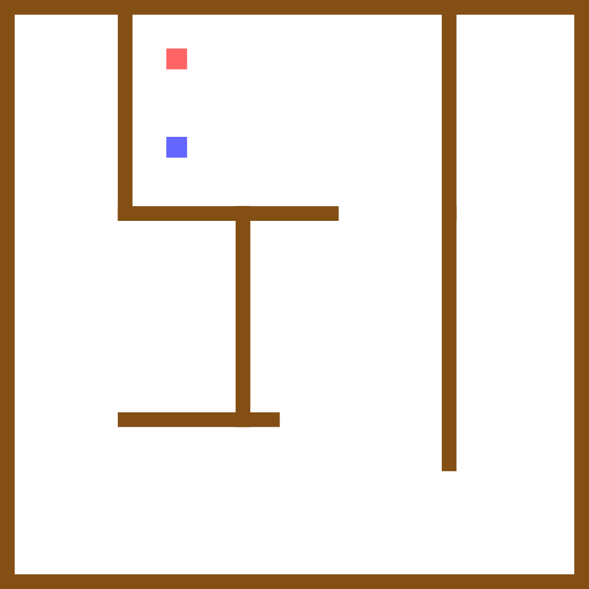

# Labyrinth

Two DotBots navigate through a labyrinth map. Each robot starts in a different
dead-end corner, finds its way to the middle-top corridor, explores the dead end
there, and settles at a different final target — Robot 1 (blue) at (600, 500)
and Robot 2 (red) at (600, 200).



## How to run

### 1. Start the controller

```bash
dotbot-controller -a dotbot-simulator \
    --simulator-init-state dotbot/examples/labyrinth/init_simulator_state.toml \
    --background-map dotbot/examples/labyrinth/labyrinth-2000x2000.png
```

### 2. Run the example

From the `PyDotBot/` root in a new terminal:

```bash
python -m dotbot.examples.labyrinth.labyrinth
```

## Options

```
  --host TEXT     Controller host.  [default: localhost]
  --port INTEGER  Controller port.  [default: 8000]
```

## Labyrinth layout

The arena is 2000 × 2000 mm. Brown bands represent walls. Key internal walls:

| Wall | Orientation | Position |
|------|-------------|----------|
| A | vertical | x = 400–450, y = 0–750 |
| B | horizontal | x = 400–1150, y = 700–750 |
| C | vertical | x = 800–850, y = 700–1450 |
| D | horizontal | x = 400–950, y = 1400–1450 |
| E | vertical | x = 1500–1550, y = 0–750 |
| F | vertical | x = 1500–1550, y = 700–1600 |

Notable dead ends:
- **Top-left pocket** (x = 50–400, y = 50–750): Robot 1 starts here.
- **Top-right pocket** (x = 1550–1950, y = 50–1600): Robot 2 starts here.
- **Top-middle corridor** (x = 450–1500, y = 50–700): both robots end up here.
  The only entrance is the gap in wall B at x = 1150–1500.

## Robot paths

**Robot 1** — blue, starts at (200, 200):
1. Explores the bottom of the left pocket
2. Exits and navigates south past wall D
3. Crosses east past wall C, then north through the gap into the top corridor
4. Explores west into the dead end → final target at (600, 500)

**Robot 2** — red, starts at (1800, 200):
1. Navigates all the way south to exit the right pocket below wall F
2. Crosses west through the main area to the gap entrance
3. Goes north through the gap into the top corridor
4. Explores the dead end → final target at (600, 200)
