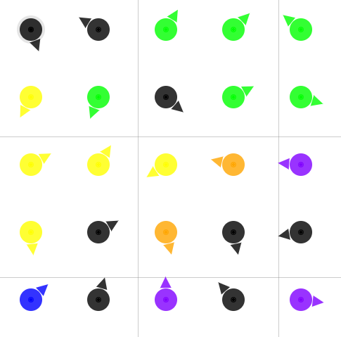
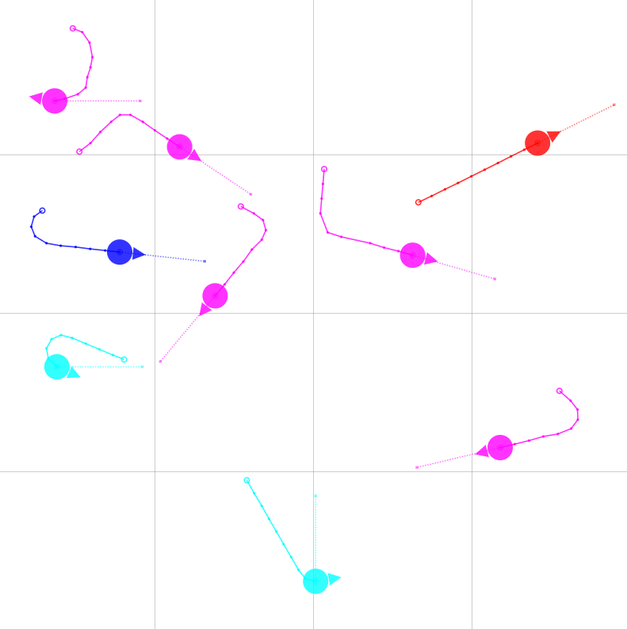

# Minimum Naming Game

This demo runs the minimum naming game in the DotBot simulator, where the robots use local communication to converge on a single word.

This demo includes two variants: a static setup without motion and a dynamic setup with motion.

**Minimum naming game without motion**



**Minimum naming game with motion**



## Install Python packages (pip)

Install the Python packages required to run this demo.

```bash
pip install pyyaml scipy
```

## How to run

### 1. Start the controller in simulator mode

**Static setup** (without motion):

```bash
dotbot-controller -a dotbot-simulator \
    --simulator-init-state dotbot/examples/minimum_naming_game/init_state.toml
```

**Dynamic setup** (with motion):

```bash
dotbot-controller -a dotbot-simulator \
    --simulator-init-state dotbot/examples/minimum_naming_game/init_state_with_motion.toml
```

### 2. Run the minimum naming game scenario

From the `PyDotBot/` root in a new terminal:

**Static setup** (without motion):

```bash
python -m dotbot.examples.minimum_naming_game.minimum_naming_game
```

**Dynamic setup** (with motion):

```bash
python -m dotbot.examples.minimum_naming_game.minimum_naming_game_with_motion
```
