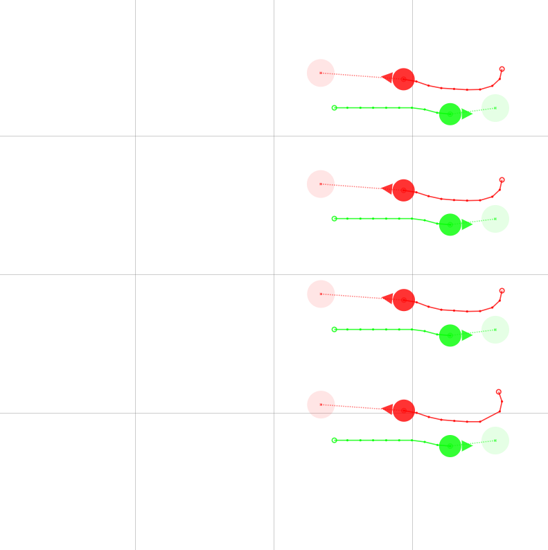

# Work and Charge

This demo shows a work-and-charge scenario in the DotBot simulator, where agents alternate moving between two regions to perform some work and return to charge.

**Work and Charge**



## Install Python packages (pip)

Install the Python packages required to run this demo.

```bash
pip install pyyaml
```

## How to run

### Specify the initial state

Specify the initial state of the DotBots by replacing the file path for ```simulator_init_state_path``` in [config_sample.toml](https://github.com/DotBots/PyDotBot/blob/main/config_sample.toml).

```toml
simulator_init_state_path = "dotbot/examples/work_and_charge/init_state.toml"
```

### Start the controller in simulator mode

```bash
python -m dotbot.controller_app --config-path config_sample.toml -a dotbot-simulator --log-level error
```

### Run the work-and-charge scenario

Open a new terminal and run the work-and-charge scenario in the top-level directory ```PyDotBot/```.

```bash
python -m dotbot.examples.work_and_charge.work_and_charge
```
