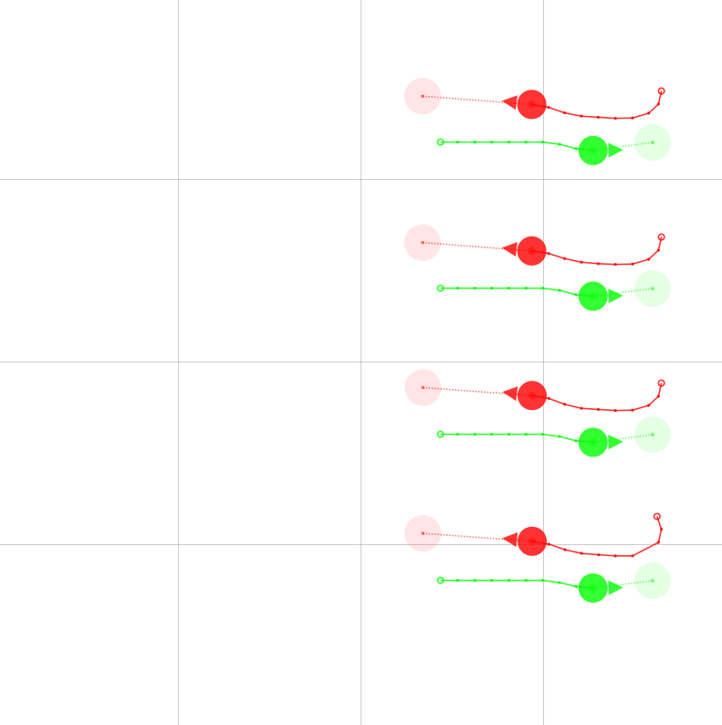

# Work and Charge

This demo shows a work-and-charge scenario in the DotBot simulator, where agents alternate moving between two regions to perform some work and return to charge.

**Work and Charge**



## Install Python packages (pip)

Install the Python packages required to run this demo.

```bash
pip install pyyaml
```

## How to run

### 1. Start the controller in simulator mode

```bash
dotbot-controller -a dotbot-simulator \
    --simulator-init-state dotbot/examples/work_and_charge/init_state.toml
```

### 2. Run the work-and-charge scenario

From the `PyDotBot/` root in a new terminal:

```bash
python -m dotbot.examples.work_and_charge.work_and_charge
```
